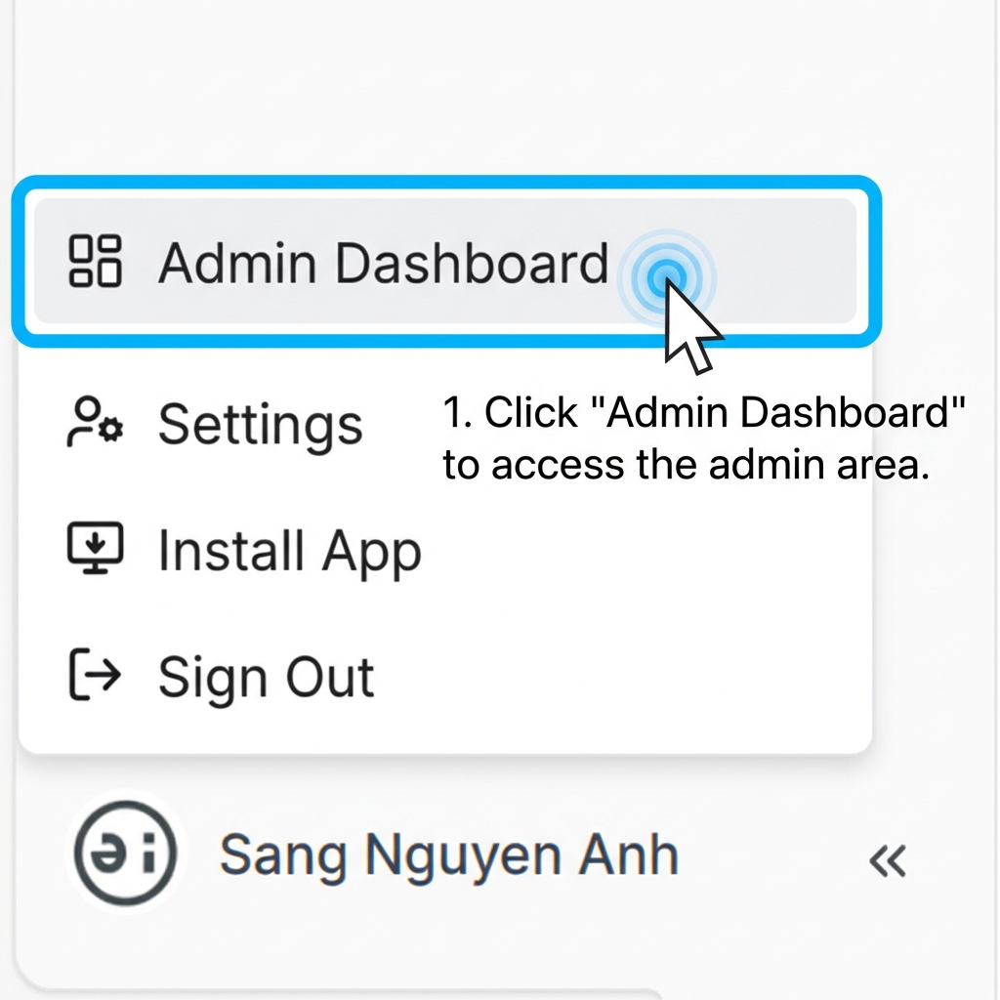

import AnnotatedImage from '@site/src/components/AnnotatedImage';

## 1. Overview

The Admin Dashboard is the central hub for users with **Admin** privileges, allowing them to:
- Quickly access frequently used administrative tasks.
- Manage users, workspaces, AI assistants, APIs, models, and access rights.
- Monitor system activity and reports.

<AnnotatedImage 
  src="/img/ui/admin/Admin_Dashboard.png" 
  alt="Admin Dashboard Overview"
/>

---

## 2. Accessing the Admin Dashboard

### Prerequisites

To access the Admin Dashboard, you must have **Administrator** role assigned to your account. If you only have a **User** role, you will not see the Admin Dashboard option.

### How to Access

Follow these steps to access the Admin Dashboard:

1. **Locate your profile** at the bottom-left corner of the application
2. Click on your **profile name** to open the user menu
3. Click **Admin Dashboard** at the top of the menu

**What happens next:**
- You will be redirected to the Admin Dashboard page
- The interface will switch from the standard user view to the administrative interface
- You can return to the regular user interface at any time by clicking your profile and selecting other options

**Note:** If you don't see the "Admin Dashboard" option in your user menu, it means you don't have administrator privileges. Please contact your system administrator to request admin access.

---

## 3. Layout Structure

### 3.1. Quick Actions Section

Displays frequently used tasks for rapid access.

**Each item includes:**
- **Name**: The name of the task.
- **Short Description**: A brief explanation of the function.
- **Action Button**: Direct navigation button to the corresponding section.

### 3.2. Administration Sections

A list of the main administrative areas of the system.

**Each section includes:**
- **Name**: The name of the management area.
- **Short Description**: A brief description.
- **View Details**: Link to navigate to the detailed page of that section.

---

## 4. Top Right Information

- Displays the **Unit / Tenant Name** currently under administration.
- Helps Admins identify the correct environment they are managing.

---

## 5. Navigation Bar Structure

The navigation bar is categorized into clear functional groups:

### 5.1. General
- **Dashboard**: The main overview page.

### 5.2. User Management
- **User Management**: Manage individual user accounts.
- **Tenant Management**: Manage organizational units.

### 5.3. Reporting
- **Analytics**: System performance and usage analysis.
- **User Usage**: Individual user activity tracking.

### 5.4. AI Management
- **Assistant Management**: Configure global AI assistants.
- **Workspace Management**: oversee all workspaces.

### 5.5. API & Model Management
- **API Key Management**: Manage connections to LLM providers.
- **Models Management**: Configure available AI models.
- **Prompt Management**: Manage system-level prompts.

### 5.6. Governance
- **Role Model Configuration**: Define role structures.
- **Roles & Permissions**: Assign permissions to roles.
- **Activity Logs**: Audit system actions.

---

## 6. Notes

- Sections are grouped by **Administration – Operations – Governance**.
- The design is focused on **fast manipulation and centralized control** for Admins.
