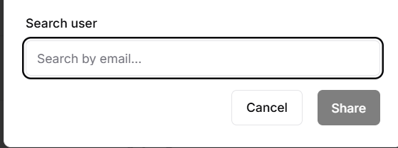

# Workspace Settings

Customize workspace-specific settings and preferences.

## Purpose
Configure workspace features and knowledge base for your organization.

## Who Can Perform This
✅ Administrators only

---

## I. Workspace Settings

### Knowledge Base Management
- **Add Documents** - Upload company policies, procedures
- **Remove Outdated** - Delete old or irrelevant content
- **Organize by Category** - HR, IT, Finance, etc.
- **Version Control** - Track document updates

### Custom Prompts/Templates (if available)
- Create reusable prompt templates
- Department-specific workflows
- Standard operating procedures

### Branding
- Company logo
- Color scheme
- Welcome message
- Footer information

---

## II. Workspace Management

### Overview

This section explains how administrators manage and share workspaces within the **Admin Dashboard → Workspace Management** area. Workspace sharing allows collaboration while maintaining ownership, visibility, and access control across the organization.

The instructions below are based on the **Workspace Management list screen**, the **Share Workspace modal**, and the **User Search dialog**.

---

### Accessing Workspace Management

1. Log in as an **Admin**.
2. Open the **User Menu** (bottom-left).
3. Select **Admin Dashboard**.
4. Navigate to **Workspace Management**.

You will see a table listing all workspaces in the current tenant.


---

### Workspace Management Screen

#### Workspace List Columns

Each row represents a workspace with the following attributes:

| Column    | Description                           |
| --------- | ------------------------------------- |
| #         | Sequential index of the workspace     |
| Workspace | Workspace name and avatar/icon        |
| Owner     | Workspace owner (name & email)        |
| Status    | Current status (e.g. Active)          |
| Sharing   | Sharing scope (Private / X users)     |
| Created   | Workspace creation date               |
| Actions   | Context menu for workspace operations |

#### Available Actions

From the **Actions (⋯)** menu, admins can:

* **Edit** – Update workspace details
* **Share** – Grant access to other users or the organization
* **Delete** – Permanently remove the workspace

> ⚠️ **Warning:** Deleting a workspace is irreversible and should be restricted to authorized admins only.

---

### Sharing a Workspace

#### Step 1: Open Share Dialog

1. In the **Workspace Management** table, locate the target workspace.
2. Click the **Actions (⋯)** menu.
3. Select **Share**.

The **Share Workspace** modal will appear.


---

### Share Workspace Modal

#### Share Scope Options

Under **Share with**, administrators can choose one of the following options:

##### 1. Specific user

* Share the workspace with selected individual users
* Access is limited to explicitly added users
* Suitable for controlled collaboration

##### 2. Everyone in organization

* Share the workspace with all users in the tenant
* All users can view and chat within the workspace
* Suitable for company-wide knowledge or templates

> ✅ **Note:** Only one sharing scope can be active at a time.

---

### Sharing with Specific Users

When **Specific user** is selected:

1. A **Search user** input field is displayed.
2. Enter the user's email address.
3. Select the user from the results.
4. Click **Share** to confirm.



#### Search User Field

| Field           | Description                               |
| --------------- | ----------------------------------------- |
| Search by email | Filters users by registered email address |

> ℹ️ **Info:** Only users that already exist in the organization can be added.

---

### Confirmation & Effects

After clicking **Share**:

* The workspace sharing settings are applied immediately
* The **Sharing** column updates (e.g. `1 users`, `2 users`)
* Added users gain instant access to the workspace

No page refresh is required.

---

### Permissions & Ownership Rules

* Workspace **Owner** retains full control
* Shared users can **view and chat** within the workspace
* Editing, deleting, or resharing is limited by role permissions
* Organization-wide sharing does not transfer ownership

---

### Best Practices

* Use **Specific user** sharing for sensitive or project-based workspaces
* Use **Everyone in organization** for reusable prompts or shared knowledge
* Periodically review shared workspaces to avoid permission sprawl
* Combine workspace sharing with **Role & Permission** policies for governance

---

### Troubleshooting

| Issue                     | Possible Cause                | Resolution                |
| ------------------------- | ----------------------------- | ------------------------- |
| User cannot see workspace | Not shared or incorrect scope | Re-check sharing settings |
| Cannot add user           | User not in tenant            | Invite user first         |
| Share button disabled     | No user selected              | Select at least one user  |

---

### Summary

Workspace sharing enables flexible collaboration while preserving control at the admin level. By choosing the appropriate sharing scope and regularly reviewing access, organizations can balance productivity and security effectively.

---

## Managing Knowledge Base

**Adding Documents:**
1. Admin Dashboard → Knowledge Base
2. Click "Upload Documents"
3. Select files (PDFs, Word docs recommended)
4. Add tags/categories
5. Click "Process and Add"
6. Wait for indexing to complete

**Removing Documents:**
1. Browse knowledge base
2. Find document to remove
3. Click "Delete" or "Remove"
4. Confirm action

:::tip Keep Updated
Regularly review and update knowledge base content to ensure users get current information.
:::

---

## Custom Welcome Message

**Example:**
```
Welcome to Neurond Assistant!

I'm here to help with:
• Company policies and procedures
• Document processing
• Email drafting
• Report summaries

Ask me anything about [YourCompany]!
```

---

## Department-Specific Settings

**If your deployment supports it:**
- Sales team: Focus on CRM processes
- HR team: Access to HR policies only
- Finance: Invoice processing emphasis
- IT: Technical documentation priority

---

## Expected Result
✅ Workspace reflects organizational structure  
✅ Knowledge base contains relevant documents  
✅ Users see customized experience  

---

## Next Steps
- [Usage Monitoring](usage-monitoring.md)
- [System Health](system-health.md)
