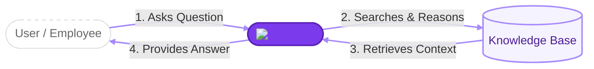
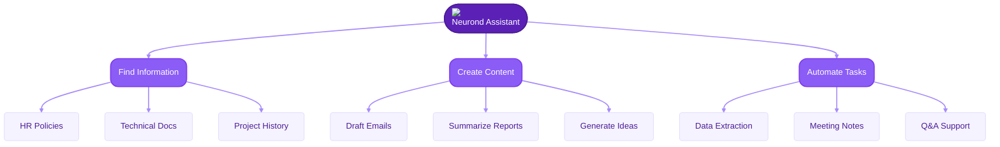
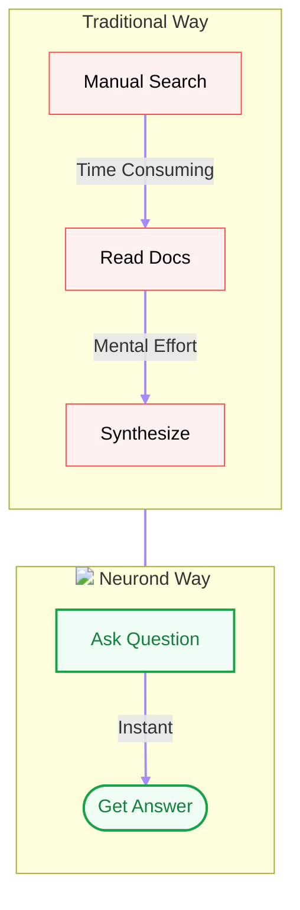

# Welcome to Neurond Assistant!

Think of **Neurond Assistant** as your very own smart office helper. It's like having a friendly assistant who has read every single document in your company and is ready to help you with anything, 24/7.

---

## What can it do for you?

Imagine you have a giant pile of papers and you need to find one specific answer. Instead of digging through them yourself, you can just ask your assistant:
- **"What is our policy on holiday leave?"**
- **"Can you summarize this 50-page report for me?"**
- **"Help me write a friendly email to a client."**

:::tip Example Chat Session
**User:** "What is the policy for remote work?"

**Assistant:** "According to the *Remote Work Policy v2.0*, employees can work remotely up to 3 days a week with manager approval. Core hours are 10 AM to 3 PM."

---

**User:** "Draft a quick email to the team about the meeting delay."

**Assistant:** "Subject: Update: Team Meeting Delayed to 2 PM
Hi Team,
Just a quick heads-up that our weekly sync is pushed back to 2 PM today. See you then!"
:::

It's here to save you time and make your work life much easier!

---

## How does it work?

You don't need to be a "computer expert" to use it. If you know how to send a text message or a chat on your phone, you already know how to use Neurond Assistant.

1. **You ask a question** (just like talking to a person).
2. **The assistant looks through the company's "library"** of information.
3. **It gives you an answer** in plain English.

---

## Why use it?

- **It never sleeps:** Need help at 10 PM? It's there.
- **It's lightning-fast:** It can read a book in seconds.
- **It helps you write:** If you're stuck on a sentence, it can give you ideas.
- **It keeps things organized:** No more searching through endless folders.

---

**Ready to start?** Let's move to the [next step](who-should-use.md) to see how it can help you in your specific job!
