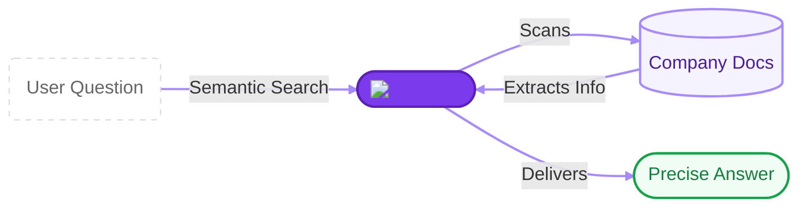
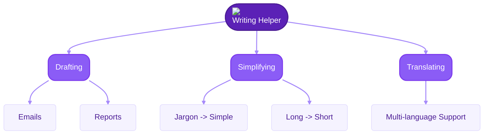
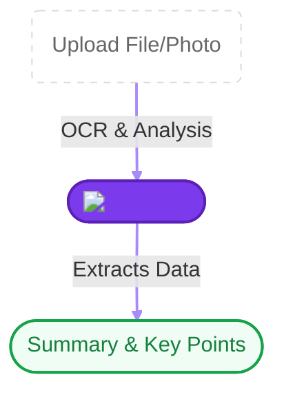

# What can Neurond Assistant do?

Neurond Assistant has a few "superpowers" that make your daily work much smoother. Think of it as a multi-tool for your office tasks.

Here are the three main things it's really good at:

---

## 🔍 1. Smart Searching (The "Library Expert")

Instead of searching for a specific file name, you can ask the assistant about the **meaning** of what you're looking for.

- **How it helps:** It searches through all company documents (PDFs, Word files, etc.) to find the exact answer for you.
- **Example:** You ask: "What should I do if my laptop breaks?" and the assistant finds the exact instruction in the "Office Safety" manual.

---

## ✍️ 2. Writing & Ideas Helper (The "Quick Writer")

Stuck on a blank page? The assistant can help you get started or clean up your writing.

- **How it helps:**
  - **Drafting:** It can write emails, reports, or lists for you.
    :::note Example
    **You:** "Draft an email to the team about the project launch."
    **Assistant:** "Hi Team, I'm excited to announce that we are launching Project X today..."
    :::

  - **Simplifying:** It can take a very complex instruction and explain it like a story for a child.
    :::info
    **Complex:** "Utilize the authentication mechanism to valid credentials."
    **Simple:** "Log in with your password to prove it's you."
    :::

  - **Translating:** It can help you understand a document written in another language.
    :::tip
    **French:** "Bonjour, comment ça va?"
    **English:** "Hello, how are you?"
    :::

- **Example:** "Rewrite this email to sound more professional and friendly."

---

## 📄 3. Document Reader (The "Quick Scanner")

Don't have time to read a 100-page manual? Or need to get info from a photo of a receipt?

- **How it helps:**
  - **Summarizing:** It can read a long file and give you the 5 most important bullet points.
  - **Reading Photos:** You can upload a photo of a document or a whiteboard, and the assistant can read the text inside it.
- **Example:** "Give me a summary of this contract's main deadlines."

---

## 🛡️ 4. Always Private & Safe

Everything you talk about with the assistant stays private within our company. It's much safer than using public tools on the internet.

---

**Excited to try it yourself?** Move on to the [Getting Started](../user-manual/login.md) section to learn how to log in for the first time!
