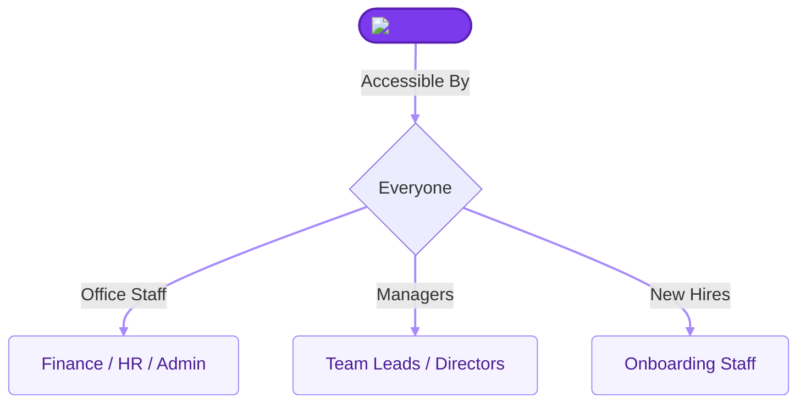
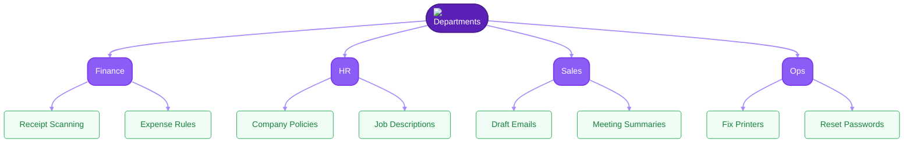
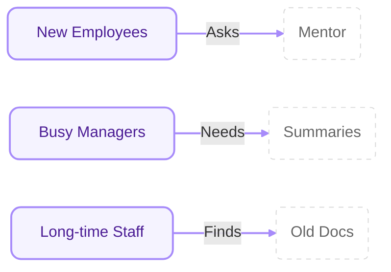
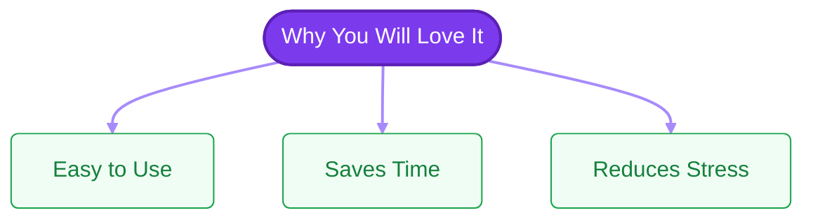

# Who can use Neurond Assistant?

The best part about Neurond Assistant is that **anybody** can use it! You don't need a degree in computer science. If you work in an office and deal with documents, emails, or questions, this tool is for you.

Here is how it helps different people in our company:

---

## 🏢 1. For Every Department

### 💰 Finance & Accounting
- **How it helps:** Instead of typing out numbers from a pile of receipts, you can show the assistant a photo of them. It can help you find figures or summarize expense rules.
- **Example:** "How much can I spend on a business lunch?"

### 👥 Human Resources (HR)
- **How it helps:** It can read through all the company rules and answer common questions for you. It can also help you draft job descriptions or training notes.
- **Example:** "What are the steps for a new employee to sign up for health insurance?"

### 📈 Sales & Marketing
- **How it helps:** It can help you write catchy emails to customers or summarize what a client said in a long meeting.
- **Example:** "Write a short email thanking Mr. Smith for his time today."

### 🛠️ Operations & IT
- **How it helps:** It can quickly find instructions for fixing a printer or explain a technical policy in simple words.
- **Example:** "How do I reset my password for the company portal?"

---

## 🎓 2. For Every Level of Experience

- **New Employees:** It's like a 24/7 mentor. You can ask all the "newbie" questions without feeling shy!
- **Busy Managers:** It saves you time by summarizing long reports so you can get the main points in seconds.
- **Long-time Staff:** It helps you find that one document from three years ago that you know is "somewhere" in the system.

---

## 🌟 3. Why YOU will love it

- **It's easy:** No complex buttons to learn.
- **It saves time:** You can finish your "boring" paperwork faster and focus on the fun parts of your job.
- **It reduces stress:** Never worry about missing a detail in a long document again.

**Ready to see what it can actually do?** Click here to see the [Key Features](key-features.md)!
