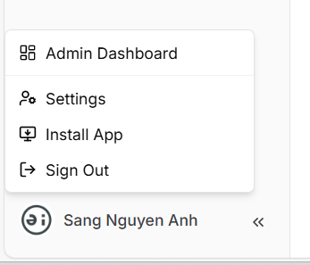
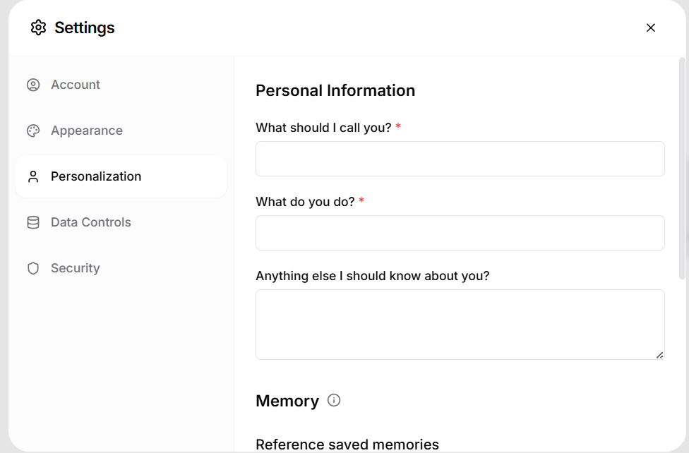
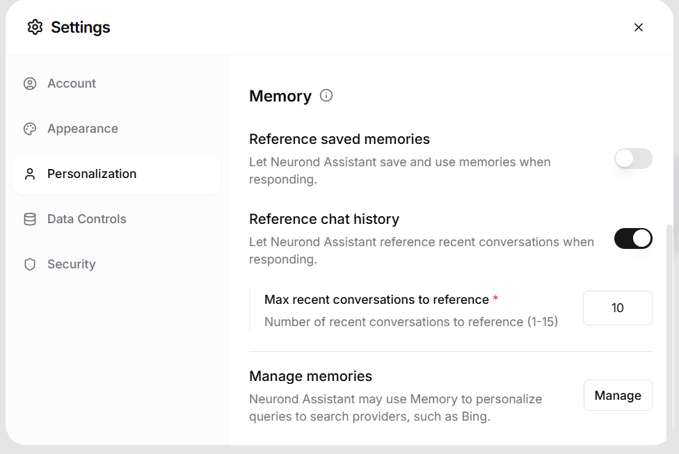
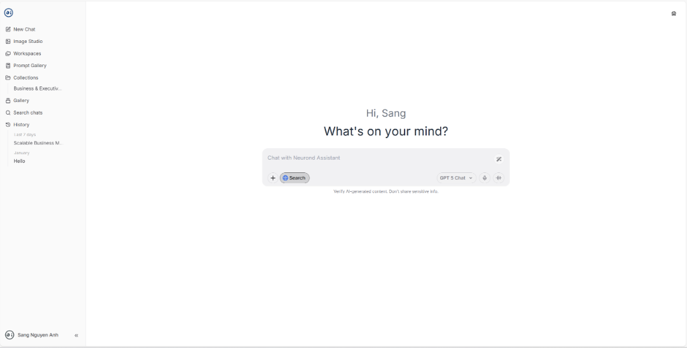

# Personalization Settings

## 1. Overview

The **Personalization** feature allows users to customize how **Neurond Assistant** addresses them, understands their background, and leverages memory and chat history to deliver more relevant, contextualized responses.

This guide explains **how to access**, **configure**, and **manage** all Personalization-related settings based on the current UI.

---

## 2. Accessing Personalization Settings

### Step 1: Open User Menu

- Locate your **profile name/avatar** at the bottom-left corner of the application.
- Click on your name to open the user menu.



### Step 2: Open Settings

- From the menu, select **Settings**.

### Step 3: Navigate to Personalization

- In the Settings sidebar, click **Personalization**.

You will now see the **Personal Information** and **Memory** sections.

---

## 3. Personal Information Section

This section defines **who you are** and **how the assistant should interact with you**.



### 3.1 What should I call you? *(Required)*

- **Purpose**: Defines the name Neurond Assistant uses when addressing you.
- **Example**:
  - `Sang`
  - `Turin`
  - `Dr. Nguyen`

**Best practice:**
- Use the name or nickname you prefer in conversations.

---

### 3.2 What do you do? *(Required)*

- **Purpose**: Helps the assistant adapt explanations, terminology, and examples to your role.
- **Example inputs**:
  - `IT Student`
  - `Software Engineer`
  - `Product Manager`
  - `Business Analyst`

**Impact:**
- Influences tone, depth, and domain-specific vocabulary used in responses.

---

### 3.3 Anything else I should know about you?

- **Purpose**: Optional contextual background for deeper personalization.
- You may include:
  - Technical level (e.g. beginner / advanced)
  - Industry focus
  - Communication preference

**Example:**

```
Third-year IT student, prefers concise technical explanations with examples.
```

---

## 4. Memory Settings

The **Memory** section controls how Neurond Assistant stores and references information across conversations.



### 4.1 Reference Saved Memories

**Toggle:** On / Off

- When **enabled**:
  - The assistant can save long-term memories (e.g. preferences, role, recurring tasks).
  - Saved memories are reused to personalize future responses.

- When **disabled**:
  - No new long-term memories are saved.
  - Existing memories are not referenced during responses.

**Recommended:** Enable for consistent long-term personalization.

---

### 4.2 Reference Chat History

**Toggle:** On / Off

- When **enabled**:
  - The assistant references recent conversations to maintain continuity.
  - Useful for multi-step tasks or ongoing projects.

- When **disabled**:
  - Each conversation is treated as isolated.

---

### 4.3 Max Recent Conversations to Reference *(Required)*

- Defines how many recent chats Neurond Assistant may reference.
- **Allowed range**: 1 – 15
- **Default value**: 10

**Guidance:**
- Lower values → Higher privacy, less context
- Higher values → Better continuity, richer context

---

### 4.4 Manage Memories

- Click **Manage** to:
  - Review saved memories
  - Remove outdated or incorrect entries
  - Control what the assistant remembers about you

**Note:** Memory data may also be used to personalize search queries (e.g. Bing), depending on Data Control settings.

---

## 5. Personalized Experience

When personalization is properly configured, Neurond Assistant will greet you by name and adapt responses to your role and preferences.



---

## 6. Privacy & Control Considerations

- Personalization settings work in conjunction with:
  - **Data Controls**
  - **Security settings**

- You always retain full control over:
  - What is saved
  - What is referenced
  - When personalization is disabled

---

## 7. Recommended Configuration (Best Practice)

**For most users:**

- ✅ Set a preferred name
- ✅ Specify your role accurately
- ✅ Enable Reference Chat History
- ✅ Enable Reference Saved Memories
- ✅ Set recent conversations to 8–12

**For high-privacy usage:**

- ❌ Disable saved memories
- ❌ Reduce recent conversations to minimum

---

## 8. Summary

The **Personalization** feature ensures Neurond Assistant adapts to you — not the other way around. Proper configuration improves:

- ✅ Response relevance
- ✅ Communication clarity
- ✅ Task efficiency

Revisit these settings anytime as your role or preferences change.

---

## Next Steps

- [Data Controls](../user-guide/data-controls.md) - Manage your data privacy
- [Security Settings](../user-guide/security.md) - Configure security options
- [Account Management](../user-guide/account.md) - Update account details
